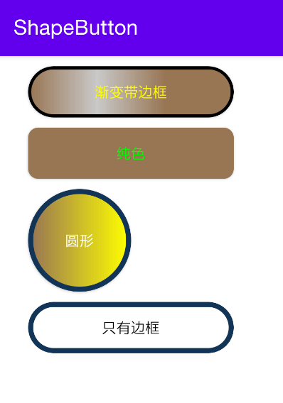

# ShapeView


[](https://jitpack.io/#kongqw/ShapeView)

How to

To get a Git project into your build:

Step 1. Add the JitPack repository to your build file

Add it in your root build.gradle at the end of repositories:

``` gralde
allprojects {
	repositories {
		...
		maven { url 'https://jitpack.io' }
	}
}
```

Step 2. Add the dependency

``` gradle
dependencies {
	implementation 'com.github.kongqw:ShapeView:1.0.5'
}
```

## 简介

该库旨在省去编写Shape文件，简洁、方便。 

包含控件：

- ShapeButton（AppCompatButton）
- ShapeEditText（AppCompatEditText）
- ShapeImageButton（AppCompatImageButton）
- ShapeImageView（AppCompatImageView）
- ShapeTextView（AppCompatTextView）
- ShapeView（View）

包含布局：

- ShapeConstraintLayout（ConstraintLayout）
- ShapeFrameLayout（FrameLayout）
- ShapeLinearLayout（LinearLayout）
- ShapeRelativeLayout（RelativeLayout）

如果你要在这些控件上使用Shape图形，编写圆角、渐变色、Stroke、以及按下、不可用状态的样式，那么这个库可以更简洁方便的满足需求。

当然，这些控件和布局都是继承的原生控件和布局，你可以直接当做原生控件和布局进行使用。

包含自定义属性如下：

| 自定义属性 | 说明  | 类型  | 举例  |
| ---- | ---- |  ---- | ---- |
| cornerType | 圆角 | enum | app:cornerType="top"<br/>app:cornerType="left"<br/>app:cornerType="right"<br/>app:cornerType="bottom"<br/>app:cornerType="rectangle"<br/>app:cornerType="circle" |
| cornerRadius | 圆角 | dimension | app:cornerRadius="10dp" |
| textColor | 字体颜色 | color | app:textColor="#FFFF00" |
| textPressedColor | 按下字体颜色 | color | app:textPressedColor="#ABCDEF" |
|textDisabledColor | 不可用字体颜色 | color | app:textDisabledColor="#FF0000" |
| backgroundColorOrientation | 背景渐变色方向 | enum | app:backgroundColorOrientation="horizontal"<br/>app:backgroundColorOrientation="vertical" |
| backgroundColors | 默认背景色 | string | app:backgroundColors="#987654,#00000000,#987654" |
| backgroundPressedColors | 按下背景色 | string | app:backgroundPressedColors="#00000000,#987654" |
| backgroundDisabledColors | 不可用背景色 | string | app:backgroundDisabledColors="#AAAAAA,#987654" |
| strokeWidth | 默认Stroke宽度 | dimension | app:strokeWidth="3dp" |
| strokePressedWidth | 按下Stroke宽度 | dimension | app:strokePressedWidth="10dp" |
| strokeDisabledWidth | 不可用Stroke宽度 | dimension | app:strokeDisabledWidth="3dp" |
| strokeColor | 默认Stroke颜色 | color | app:strokeColor="#000000" |
| strokePressedColor | 按下Stroke颜色 | color | app:strokePressedColor="#FF00FF" |
| strokeDisabledColor | 不可用Stroke颜色 | color | app:strokeDisabledColor="#00FF00" |


效果图：




